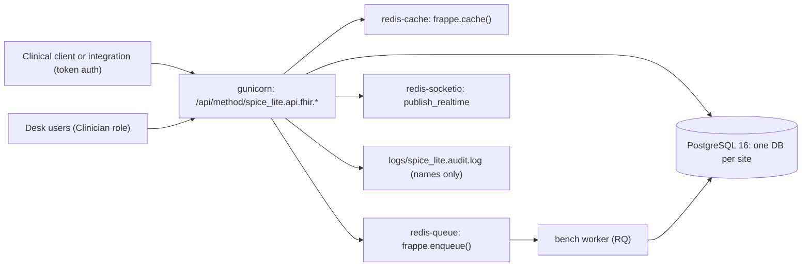

# Architecture overview: spice_lite on Frappe v15

## Context
`spice_lite` is a teaching-size slice of a Frappe clinical core modelled on `spice_next_core`. It runs as one Frappe **app** installed on a **site** in a **bench**. Production follows the spice platform shape: one deployment per country, PostgreSQL 16, three Redis roles, gunicorn web workers, and RQ background workers. Integration apps (for example a telephony integration) declare `required_apps = ["spice_lite"]`. ERPNext, where present, is an external integration target, not part of the clinical core.

## App structure (`sample-app/spice_lite/spice_lite/`)
| Path | Responsibility |
|---|---|
| `hooks.py` | App metadata, `after_install` / `after_migrate` (create the `Clinician` role). No `doc_events`, `scheduler_events` or permission hooks yet. |
| `clinical/doctype/sl_patient/` | `SL Patient`: `mrn` (unique), `first_name`, `last_name` (search_index), `gender`, `birth_date` (not in future), `active`, `country` (Link `SL Country`, search_index). Named `SLP-.#####`, never by MRN. |
| `clinical/doctype/sl_encounter/` | `SL Encounter`: `patient`, `encounter_date`, `encounter_type`, `status`, `practitioner` (Link User). |
| `clinical/doctype/sl_observation/` | `SL Observation`: `patient`, `encounter`, `code` (LOINC), `code_display`, `status`, `effective_datetime`, `value`, `unit`, `replaces`. `final` is immutable; corrections are new `amended` docs. |
| `clinical/doctype/sl_country/` | `SL Country`: the per-deployment country, used by the backfill patch. |
| `api/fhir.py` | Whitelisted FHIR-lite endpoints: `get_patient`, `search_patients`, `create_observation` (POST), `lastn`. Errors return an `OperationOutcome` with an HTTP status. |
| `api/mappers.py` | Pure functions mapping docs to FHIR-lite JSON (no `import frappe`). |
| `audit.py` | `log_access`: who did what to which document names, via `frappe.logger("spice_lite.audit")`. |
| `patches/v0_1/backfill_patient_country.py` | Example data patch, listed in `patches.txt`. |
| `tests/` | `FrappeTestCase` integration tests and pure unit tests for mappers. |

## Permissions
DocType permissions: `Clinician` read/write/create on the clinical DocTypes, no delete; `System Manager` full. Every API read goes through `frappe.has_permission` / `frappe.get_list`. No method is `allow_guest`.

## Known constraints and decisions
- FHIR-lite JSON shapes over whitelisted methods, not a conformant FHIR server (ADR-0001).
- `lastn` contains the intentional N+1 (`TEACHING-DEFECT(perf-n+1)`), used by performance exercises.
- Frappe v15 on PostgreSQL is supported but receives no more Postgres fixes (Frappe's own warning); one v15 Postgres filter bug is worked around (D-2 in `sample-app/docs/KNOWN_DEFECTS.md`).
- Country-specific behaviour belongs in a country app (Custom Fields, Property Setters, `doc_events`), not in `spice_lite`.

## ADRs
See `docs/adr/`. Format: `docs/adr/0000-template.md`.
