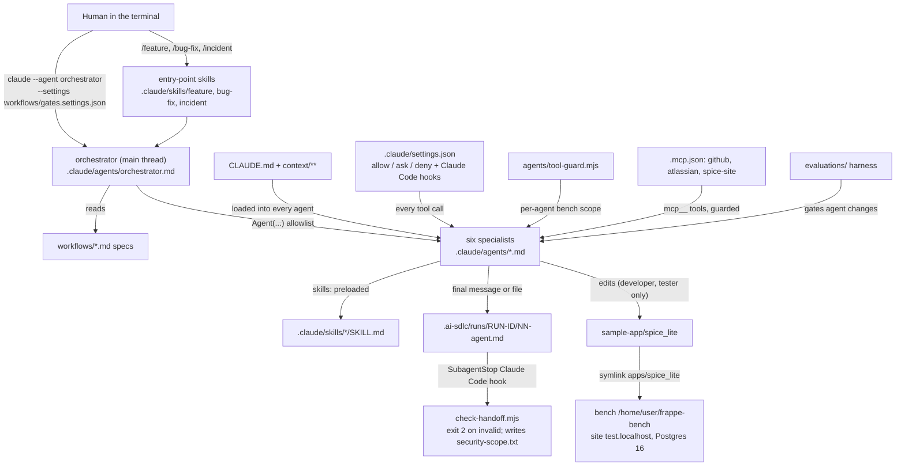

# Capstone: the AI-SDLC engineering system on a Frappe bench, assembled

Module `11-capstone` of the course (Frappe edition). This folder shows how every component in `AI-SDLC-frappe/` fits together, walks one feature and one incident through the whole system, and gives you a checklist for moving the system from `spice_lite` on the course bench to your own `spice_next_core`-style bench.

| File | What it is |
|---|---|
| [README.md](README.md) | this file: component map, gate map, how to prove the system is wired |
| [walkthrough-feature.md](walkthrough-feature.md) | OBS-51 (controlled vocabulary for Observation codes: new DocType, `Data` to `Link`, fixture, patch) through the system, command by command |
| [walkthrough-incident.md](walkthrough-incident.md) | INC-2026-0922-01 (a 100-subject `lastn` ward board saturates the Kenya site's gunicorn workers) through the system, command by command |
| [example-runs/incident-lastn-ward-board/](example-runs/incident-lastn-ward-board/) | the committed handoffs of that incident run (validated by `check-handoff.mjs`) |
| [personalize-checklist.md](personalize-checklist.md) | what to change to run this system on your own bench, apps and sites |
| `../../scripts/capstone/verify-system.mjs` | one command that checks the whole system is wired, including the bench-facing pieces (PASS/WARN/FAIL table) |
| `../../scripts/capstone/stack-inventory.mjs` | lists every file that still encodes `spice_lite`, the course bench or the invented Kenya deployment, per component |

## Component map



Every row below is a folder or file group in `AI-SDLC-frappe/`. **Tag** says whether the file's format is a real Claude Code format checked against the docs (`verified-format`) or a convention of this course (`illustrative`). A script's behaviour is tested either way; the tag is only about Claude Code format claims.

| Path | Purpose | Built in module | Tag |
|---|---|---|---|
| `CLAUDE.md` | project memory: bench path and site, 3 `@imports`, 9 rules, the bench commands that prove a change | 00-example | verified-format |
| `.claude/rules/spice-lite-python.md`, `.claude/rules/doctype-json.md` | Python rules for `**/*.py`; patch, `search_index` and permissions rules for DocType JSON, `patches.txt`, `hooks.py` (`paths`) | 00-example | verified-format |
| `context/architecture/`, `context/domain/`, `context/security/`, `context/standards/` | context pack: architecture, spice_lite glossary with PHI table, PHI and site_config policy, threat model, Frappe coding/testing/API/review standards | 00-example | illustrative |
| `docs/adr/` | ADR template and ADR-0001 (FHIR-lite over whitelisted methods) | 00-example | illustrative |
| `agents/CONTRACT_TEMPLATE.md`, `docs/foundations/` | Agent Contract template, anatomy and primitive-choice exercises (Claude Code hook vs Frappe hook), contract validator | 01-foundations | illustrative |
| `evaluations/agent-versions/reviewer-v1.md` | the first reviewer agent, frozen as the v1 snapshot module 09 compares against | 02-first-agent-skill-tools | verified-format |
| `.claude/skills/explain-endpoint/`, `.claude/skills/run-tests/` | trace a whitelisted method route to SQL; run `bench run-tests` and parse its output (`parse_bench_tests.py`, because the exit code is 0 on failures) | 02-first-agent-skill-tools | verified-format (SKILL.md), illustrative (scripts) |
| `docs/tutorials/level-2/` | restricted reviewer, Bash guard and its test, practice patches, SQL capture tool | 02-first-agent-skill-tools | illustrative |
| `.claude/skills/architecture-review/`, `code-review/`, `test-strategy/` | core vs country app vs integration app decisions and ADRs; Frappe diff review (`get_all`, `ignore_permissions`, SQL params, patches, fixtures); test plans mapped to `FrappeTestCase` and `run-tests` flags. `code-review` replaces the bundled `/code-review` here | 03-skills-architecture-code-test | verified-format (SKILL.md), illustrative (templates, scripts, examples) |
| `.claude/skills/security-review/`, `performance-review/`, `production-rca/` | security review with bench probes; the measured `lastn` N+1 and its set-based patch; RCA method and the INC-2026-0922-01 evidence pack | 04-skills-security-performance-rca | verified-format (SKILL.md), illustrative (probes, examples, scripts) |
| `skills/<name>/README.md`, `CHANGELOG.md`, `tests/` | each skill as an owned, versioned asset with golden cases | 03, 04 (library rules: 10) | illustrative |
| `.claude/agents/architect.md` ... `sre.md` | the six specialists: tools, `disallowedTools: Agent`, model, effort, `maxTurns`, preloaded skills, bench-scoped Claude Code hooks | 05-agent-roster | verified-format |
| `agents/<name>/CONTRACT.md`, `agents/tool-guard.mjs`, `agents/check-agents.mjs`, `agents/reviewer/fixtures/` | contracts; per-agent write scope and bench allowlist (`?bench ... migrate` asks, console/execute never); conformance checker | 05-agent-roster | illustrative (the guard is registered through verified-format frontmatter `hooks`) |
| `.mcp.json` | GitHub, Atlassian and the local `spice-site` stdio server | 06-mcp-and-tooling-architecture | verified-format |
| `mcp/spice-site-server/`, `mcp/permissions.settings-fragment.json` | PHI-safe, read-only site server over whitelisted methods (fixture or live mode) and its client tests; MCP permission rules to merge | 06 | illustrative (server), verified-format (settings fragment) |
| `.claude/skills/ticket-intake/`, `docs/mcp/`, `scripts/automation/` | Jira intake with PHI redaction; MCP decision guide; deterministic `patches.txt`, DocType JSON, PHI-logging and `.mcp.json` gates | 06 | verified-format (SKILL.md), illustrative (rest) |
| `workflows/composition/` | one-vs-many measurement, execution modes, depth limits, `check-roster-flat.mjs`, `security-scope.mjs` (diff to MANDATORY/SKIP), `depth-2.settings.json` | 07-agent-composition | illustrative (`depth-2.settings.json` verified-format) |
| `.claude/agents/orchestrator.md`, `agents/orchestrator/CONTRACT.md` | main-thread orchestrator: `Agent(architect, developer, reviewer, tester, security, sre)`, no Bash, `SubagentStop` handoff hook | 08-workflow-orchestration | verified-format (agent), illustrative (contract) |
| `.claude/skills/feature/`, `bug-fix/`, `incident/`, `requirements/`, `implementation-plan/` | slash-command entry points and the orchestrator's own steps | 08 | verified-format |
| `workflows/README.md`, `feature-delivery.md`, `bug-fix.md`, `incident-response.md`, `examples/` | handoff format, workflow specs, the committed OBS-51 feature run with real patches and bench evidence | 08 | illustrative |
| `workflows/gates.settings.json` | `ask` rule on `Agent(developer)`: gate G1 | 08 | verified-format |
| `.claude/hooks/check-handoff.mjs` (+ test) | validates handoffs as a `SubagentStop` Claude Code hook (exit 2) and as a CLI; requires quoted `Ran N tests` / `OK` from developer and tester | 08 | illustrative |
| `evaluations/` (except `agent-versions/reviewer-v1.md`) | architect and reviewer golden tasks, Frappe hallucination traps verified against the v15 source, harness (`--mode replay` offline, `--mode live` with `claude -p`), rubrics, synthetic recordings, reports | 09-agent-evaluation | illustrative |
| `.claude/settings.json` | permissions `allow`/`ask`/`deny` for bench and git, `PreToolUse` and `PostToolUse` Claude Code hooks | 00 (base), 10-governance (extended) | verified-format |
| `.claude/hooks/block-secrets.mjs`, `guard-bench.mjs`, `guard-outbound.mjs`, `flag-injection.mjs` (+ tests) | block secrets in writes; ask/deny on site-changing bench spellings the rules miss; ask/deny on MCP writes; flag injected instructions from Jira and DocType content | 00, 10 | illustrative |
| `docs/governance/` | approval gates G1 to G10, prompt injection, site secrets and integration users, model and cost policy, CODEOWNERS and CI gate examples | 10 | illustrative (`managed-settings.example.json` verified-format) |
| `company-ai/` | the skill library packaged as a Claude Code plugin | 10 | verified-format (`plugin.json`, SKILL.md) |
| `skills/README.md`, `scripts/governance/` | library policy; agent policy, AI-config and schema approval gate, cost report, API-user audit, library validator | 10 | illustrative |
| `README.md`, `docs/capstone/`, `scripts/capstone/` | entry point, this capstone, system verification and reference-system inventory | 11-capstone | illustrative |
| `sample-app/` | the Frappe v15 app `spice_lite` (4 DocTypes, FHIR-lite whitelisted API, one patch, 46 tests), `scripts/setup-bench.sh`, Docker stack, `docs/KNOWN_DEFECTS.md` (T-1, D-1..D-12) | shared | not a Claude Code file |
| `.ai-sdlc/runs/` | handoffs of live runs (git-ignored) | runtime | illustrative |

## Gate map: workflow gates and governance layers

Module 08 numbers the workflow gates (G1, G1b, G2, G3, plus G-M in incidents). Module 10 numbers the governance layers G1 to G10 in `docs/governance/approval-gates.md`. They are the same controls seen from two sides:

| Workflow gate (module 08) | When | Mechanism that enforces it | Mechanism or convention | Governance layer (module 10) |
|---|---|---|---|---|
| G1 plan approval | every developer launch, including each rework | `ask: ["Agent(developer)"]` from `workflows/gates.settings.json`, loaded with `--settings` | mechanism (permission prompt) | G1 plan approval, implemented as a permission `ask` instead of plan mode |
| G1b test-site schema | inside a developer step whose plan changes DocType JSON or `patches.txt` | `?bench --site test.localhost migrate` in the developer's tool-guard, `ask` rules in `.claude/settings.json`, `guard-bench.mjs` for other spellings | mechanism | G2 bench command that changes a site |
| G2 findings | after tester and security, and after review | orchestrator stops with `status: needs-human` | **convention** (a prompt instruction, not a built-in feature); the backstop is the next `Agent(developer)` prompt and the PR | none |
| G-M mitigation | incidents, after 02-sre | orchestrator has no Bash; sre's guard allows read-only diagnostics on `test.localhost` only; `migrate`/`execute`/`console`/`set-config`/`run-patch` ask, `drop-site`/`reinstall`/`restore` deny; the country site is out of reach entirely | mechanism | G2, G6 never allowed, G9 migrate a shared site |
| G3 merge | end of every run | human PR review; `git push` ask, `gh pr merge` and GitHub MCP merge deny; CODEOWNERS on `**/doctype/**`, `patches.txt`, `hooks.py`, `fixtures/**`; required check `ai-change-gate` (`scripts/governance/check-ai-change-approval.mjs`) | mechanism (branch protection) | G7 AI-config merge, G8 schema merge |
| always on | every tool call | `block-secrets.mjs`, `guard-bench.mjs`, `guard-outbound.mjs`, `flag-injection.mjs` (advisory), `Read(**/site_config.json)` deny, `Edit(./.claude/**)` ask, managed floor | mechanism | G3, G4, G5, G6, G10 |

Run gated workflows in `default` permission mode. In `dontAsk` every `ask` becomes a denial, so a headless run stops at G1 by design. The mode table in `docs/governance/approval-gates.md` says which prompts survive which mode.

## Prove the system is wired

```bash
cd AI-SDLC-frappe
node scripts/capstone/verify-system.mjs                                   # repo only; exit 0 = WIRED
node scripts/capstone/verify-system.mjs --bench /home/user/frappe-bench   # plus the bench: apps/spice_lite, sites/apps.txt,
                                                                          # bench --site test.localhost list-apps, eval traps
node scripts/capstone/verify-system.mjs --with-tests                      # plus every *.test.mjs and the app's unit tests
node scripts/capstone/verify-system.test.mjs                              # the checker's own tests (34 cases)
```

It checks, one row each: roster files and contracts; flat delegation and an orchestrator without Bash; preloaded skills; settings JSON, documented hook events and every hook script path (settings and frontmatter); the Frappe permission floor (site_config reads denied, migrate asks, drop-site and reinstall denied, no allow rule for console or execute); the G1 gate settings; `.mcp.json`; that workflow step tables name only roster agents and real skills; CLAUDE.md imports; that each script a preloaded skill tells an agent to run passes that agent's real `tool-guard.mjs` (and a WARN when a skill pre-approves a command the guard blocks); the `spice_lite` layout (`hooks.py` app name and dotted paths, `modules.txt` packages, `patches.txt` modules with `def execute()`, every DocType folder with json, controller class and test); every committed example run through `check-handoff.mjs`; the eval replay; and the module checkers (`check-agents`, `check-roster-flat`, `check-agent-policy`, `validate-skill-library`, `check-mcp-config`, `check-patches`, `lint-doctype-json`). With `--bench` it also checks that `apps/spice_lite` is this repo's app, that the site lists it (and its `required_apps`) in `bench --site test.localhost list-apps`, that CLAUDE.md names the same bench, and that every hallucination trap in the eval datasets is false in `<bench>/apps/frappe`. In the shared course container the bench call holds `flock /tmp/spice-bench.lock`.
