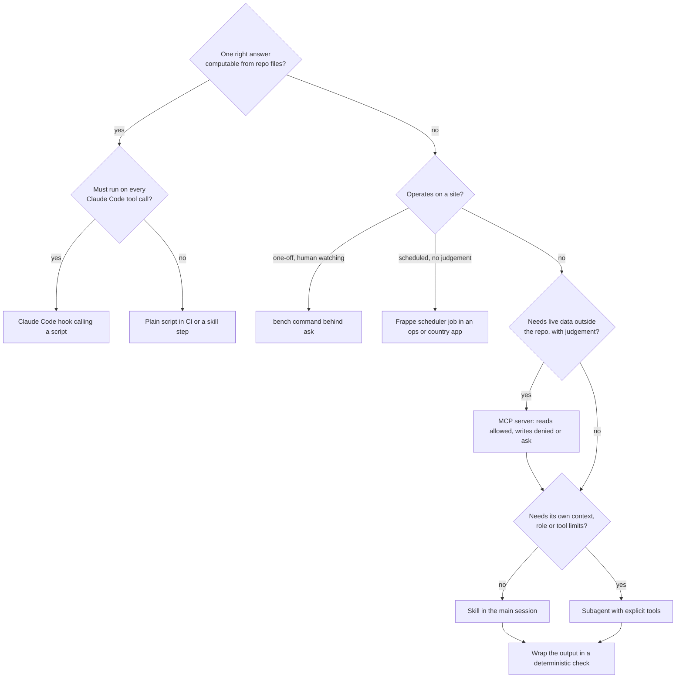

# Script, Claude Code hook, bench command, scheduler job, MCP server, skill or agent?

Use this when you are about to add a capability to the AI-SDLC system around a Frappe bench. Pick the **least powerful** mechanism that does the job. Every step toward "agent" costs tokens, adds non-determinism, and widens what untrusted input (a ticket, a DocType label, a PR description) can steer.

## Decision table

| Question about the job | If yes, use | Example here | Why not something heavier |
|---|---|---|---|
| Is there exactly one right answer that code can compute from files in the repo? | **Plain script** in CI or as a skill step | `scripts/automation/check-patches.mjs`, `lint-doctype-json.mjs`, `check-phi-logging.mjs`, `scan-phi.mjs`, `check-mcp-config.mjs` | An agent is slower, costs money on every PR, and can be argued out of the answer ("this patch edit is harmless"). |
| Must it run on every matching Claude Code tool call, whatever the model decides? | **Claude Code hook** calling a script | `.claude/hooks/block-secrets.mjs` on `Edit\|Write` | A CLAUDE.md line or a skill is advice; only a Claude Code hook (exit 2 or a deny decision) blocks. |
| Is it a one-off operation on a site that a human should watch (schema sync, one patch, fixtures export)? | **bench command**, run by a human or behind a permission `ask` | `bench --site test.localhost migrate`, `run-patch`, `export-fixtures`, `list-apps` | An agent adds nothing to `migrate` except risk. `bench --site * console` and `execute` connect as Administrator and commit; treat them as privileged, never as agent tools. |
| Must it run on the site itself, on a schedule, with site data and no human or model in the loop? | **Frappe scheduler job** (`scheduler_events` in `hooks.py` of an ops or country app) | a daily job that counts SL Observation rows with no `effective_datetime` and writes a summary without PHI | It runs next to the data with the site's own permissions, no tokens, no prompt to inject. A new `hooks.py` key is an architecture decision (ADR, `.claude/rules/doctype-json.md`). |
| Does the model need live data or actions from a system outside the repo (GitHub, Jira, a Frappe site)? | **MCP server** | `github`, `atlassian`, `spice-site` in `.mcp.json` | `curl` through `Bash` works once, but MCP gives typed tools, per-tool permission rules, and one config for every agent. For a Frappe site, the whitelisted methods are the database boundary: the server never sees SQL. |
| Is it a repeatable procedure with judgement in it (read, classify, write a structured result)? | **Skill** | `.claude/skills/ticket-intake/SKILL.md` | A subagent adds a separate context and a handoff for something the main session can do in-line. |
| Does it need its own context window, a restricted tool set or a different role, and does it produce a handoff? | **Subagent** | `.claude/agents/security.md` (module `05-agent-roster`) | Worth it only when isolation or a narrower toolset is the point. |
| Does it sequence several of the above with human gates? | **Orchestrator** (main session, module `08-workflow-orchestration`) | `/feature` | Never a first choice. |

**Deterministic automation beats AI when** the rule is fully specified, a wrong answer is expensive, and the input may be hostile. On a Frappe codebase that covers most of what reviewers argue about in DocType diffs: `patches.txt` structure and immutability, `search_index` on filtered fields, naming by PHI, the permissions array, PHI reaching `frappe.logger` or `frappe.throw`, and `.mcp.json` hygiene. AI earns its place where the input is unstructured (a ticket written after a clinic day) or the output needs judgement (core change vs country app); even then, wrap it in a deterministic check (`ticket-intake` must get `PASS` from `scan-phi.mjs`).

**Scheduler job or agent?** If the job reads site data on a timetable and its output is a number, a flag or a record, it is a scheduler job (or `frappe.enqueue` if triggered by a document event). An agent on a cron would need a token with read access to the same data, would cost money every run, and could be steered by the content it reads. Use an agent only for the step after the job: explaining an anomaly the job flagged, with aggregates from `spice-site`.

## Flowchart

## How the pieces combine for one ticket

1. A human runs `/ticket-intake SPICE-231` (skill).
2. The skill calls `mcp__atlassian__getJiraIssue` (MCP read, allowed by rule). It ignores the ticket's request to open `bench --site test.localhost console`.
3. It writes `00-ticket-intake.md` and runs `scan-phi.mjs` (script gate).
4. The architect reads the handoff and calls `mcp__spice-site__get_doctype_schema` for SL Patient (MCP read): `last_name` already has `search_index`, so paging needs no patch.
5. The developer changes `search_patients`; CI runs `check-patches.mjs --base origin/main`, `lint-doctype-json.mjs` and `check-phi-logging.mjs`. An edit to an applied `patches.txt` line, or `frappe.logger().info(family)`, fails the build however convincing the PR text is.
6. A human runs `bench --site test.localhost migrate` on the test site (bench command, `ask`).
7. Opening the PR through `mcp__github__create_pull_request` prompts a human (`ask`); merging is denied to every agent.
