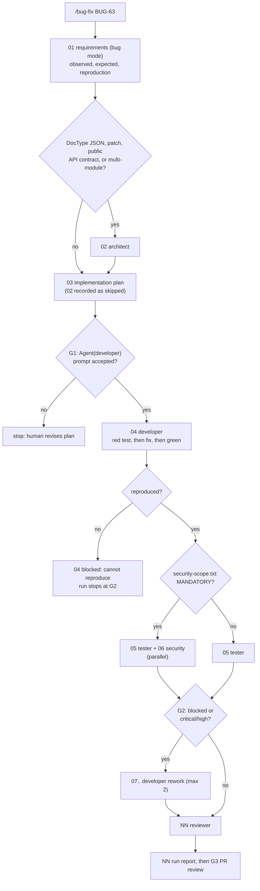

# Workflow: bug fix (Frappe edition)

Entry point: `/bug-fix <bug-id> <observed behaviour>` (skill `.claude/skills/bug-fix/SKILL.md`), run by the orchestrator with `--settings workflows/gates.settings.json`.
Run id: `YYYY-MM-DD-bug-<slug>`. Handoff format: [README.md](README.md).

The difference from feature delivery: evidence comes first. No fix is accepted without a regression test that fails before the fix and passes after it (`context/standards/testing-standards.md`: "Every bug fix starts with a failing test", test named after the defect id). Both bench summaries are quoted in the developer handoff: the red run (`FAILED (failures=1)`) and the green run (`OK`).

## Steps

| step | file | agent | inputs | output | gate / condition |
|---|---|---|---|---|---|
| 01 | `01-requirements.md` | orchestrator (`requirements`, bug mode) | `ticket:<bug-id>` | observed vs expected, reproduction as a `call(fhir.<method>, ...)` in a `FrappeTestCase` or a `curl` with synthetic data, regression test name `test_<bugid>_<behaviour>` | none |
| 02 | `02-architect.md` | architect | 01 | design impact, patch need, ADR if a public contract changes | **conditional**: only if the fix changes DocType JSON, needs a patch, changes a whitelisted method's response contract, or spans more than one module |
| 03 | `03-implementation-plan.md` | orchestrator (`implementation-plan`) | 01, 02 if present | root-cause hypothesis with `path:line`, the red test first, fix steps, security scope prediction | `needs-human` |
| 04 | `04-developer.md` | developer | 03 | regression test (red, quoted `FAILED` summary), fix (green, quoted `OK` summary), full `bench --site test.localhost run-tests --app spice_lite` | **G1**; `blocked` with "cannot reproduce" if the red run is green |
| 05 | `05-tester.md` | tester | 01, 04 | neighbouring cases (other params, other roles via `frappe.set_user`, Postgres vs MariaDB differences) | parallel with 06 |
| 06 | `06-security.md` | security | 04, `security-scope.txt` | findings | **conditional** on `security-scope.txt` (same six rules as [feature-delivery.md](feature-delivery.md)); parallel with 05 |
| 07, 08 | `NN-developer.md` | developer | blocking handoffs | fixes | after **G2** |
| next | `NN-reviewer.md` | reviewer | 03, 04, 05, 06 | findings; checks that 04 quotes the red run before the green run | G2 if critical/high |
| last | `NN-run-report.md` | orchestrator | all | summary | **G3** |

## Worked inputs (spice_lite)

**A real open defect.** `/bug-fix BUG-63 FHIR effectiveDateTime has no UTC offset` is defect D-3 in `sample-app/docs/KNOWN_DEFECTS.md`: `_iso()` in `spice_lite/api/mappers.py` emits `2026-09-30T13:26:09` with no offset. CLAUDE.md rule 8 allows the fix because the ticket asks for it explicitly. The fix changes the response contract of every Observation-returning method, so 02 architect runs (conditional), and `security-scope.txt` will say MANDATORY because `spice_lite/api/` changes (rule 2). The regression test is `test_d3_effective_datetime_has_offset`. The plan keeps `mappers.py` free of `import frappe` by passing the time zone name in from `fhir.py` (`frappe.utils.get_system_timezone()`), exactly as the defect entry proposes.

**A correct "cannot reproduce".** `/bug-fix BUG-57 Family search is case-sensitive on Postgres`. On Postgres, frappe turns `like` filters into `ilike` (`frappe/model/db_query.py`), and `search_patients` filters with `["last_name", "like", f"{family}%"]`, so a lower-case family already matches. The developer's red test (`call(fhir.search_patients, family=self.family.lower())`) passes on `main`, so 04 is `blocked` with "cannot reproduce" and the bench summary of the passing reproduction. The run stops at G2 and asks the reporter for the exact request. That is the correct outcome, not a failure of the workflow.

## Failure and retry policy

| failure | action |
|---|---|
| reproduction test passes before the fix (cannot reproduce) | developer returns `blocked` with the quoted `OK` run; orchestrator stops with `needs-human` and asks for more detail; no fix is written |
| fix makes the regression test pass but breaks another test | developer handles it (three cycles), else `blocked` |
| the bug is `TEACHING-DEFECT(perf-n+1)` or an open defect (D-1, D-3, D-6 to D-12) | proceed only if the report is explicitly about that defect (CLAUDE.md rule 8); otherwise stop with `needs-human` |
| the fix needs a data correction on existing sites | the plan adds a patch module in `patches.txt` (`[post_model_sync]`), idempotent, with its own test; never edit an applied patch |
| invalid handoff, agent error, third rework, rejected migrate prompt | as in [feature-delivery.md](feature-delivery.md) |
