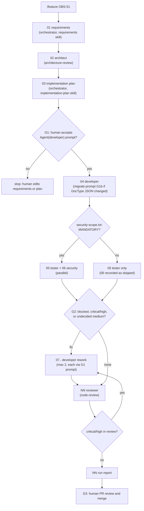

# Workflow: feature delivery (Frappe edition)

Entry point: `/feature <ticket-id> 
` (skill `.claude/skills/feature/SKILL.md`), run by the orchestrator (`claude --agent orchestrator --settings workflows/gates.settings.json`, or an ordinary main session with the same `--settings`).
Run id: `YYYY-MM-DD-feat-<slug>`. Handoff format and run folder rules: [README.md](README.md). Worked example: [examples/feature-observation-code-vocabulary/](examples/feature-observation-code-vocabulary/).

A Frappe feature is rarely "just Python". A typical change touches up to five surfaces that must be reviewed together: **DocType JSON** (fields, `permissions`, `search_index`), the **controller**, a **patch** listed in `patches.txt`, **tests**, and **fixtures** or `hooks.py`. The steps below keep those surfaces visible from requirements to PR.

## Steps

| step | file | agent | skill | inputs | output | gate / condition |
|---|---|---|---|---|---|---|
| 01 | `01-requirements.md` | orchestrator | `requirements` | `ticket:<id>` or `00-ticket-intake.md` (module 06) | user story, AC table with exact whitelisted-method calls or DocType operations, non-functional (PHI, queries, compatibility), scope | none |
| 02 | `02-architect.md` | architect | `architecture-review` (preloaded) | `01-requirements.md` | where the change lives (core vs country app vs integration app), controller vs `doc_events`, patch and fixture needs, ARC findings, ADR draft | none |
| 03 | `03-implementation-plan.md` | orchestrator | `implementation-plan` | 01, 02 | plan table P1..Pn per Frappe surface, security scope prediction, migrate need, rollback | status always `needs-human` |
| 04 | `04-developer.md` | developer | `run-tests` (preloaded) | 03 | DocType JSON, controller, patch + `patches.txt`, fixtures, tests; quoted `Ran N tests ... OK`; every changed path in `## Artifacts` | **G1**: `Agent(developer)` ask prompt; **G1b**: `bench --site test.localhost migrate` prompt |
| 05 | `05-tester.md` | tester | `test-strategy`, `run-tests` | 01, 03, 04 | AC coverage map, new tests (permission tests with `frappe.set_user`, patch idempotency, 4xx `OperationOutcome`), quoted bench summary | parallel with 06 |
| 06 | `06-security.md` | security | `security-review` | 04, `security-scope.txt` | security findings | **conditional** (below); parallel with 05 |
| 07, 08 | `07-developer.md` | developer | `run-tests` | blocking handoffs | fixes | after **G2**; each launch through the G1 prompt |
| next | `NN-reviewer.md` | reviewer | `code-review` | 03, 05, 06, latest developer | findings on the Python and DocType JSON diff, `patches.txt`, `hooks.py`, fixtures together; verdict | G2 again if critical/high |
| last | `NN-run-report.md` | orchestrator | none | all | step table, open findings, human actions (PR, migrate per country site) | ends with **G3** |

Step numbers are fixed through 06. Skipped steps keep their number unused, so `06` missing from the folder means security was skipped (the run report says why). Rework and review take the next free numbers.

## Conditional branch: security step

The decision is made from the **diff**, not from a model's opinion. When the developer subagent stops, the `SubagentStop` Claude Code hook (`.claude/hooks/check-handoff.mjs`) runs `workflows/composition/security-scope.mjs` on `git diff HEAD -- sample-app` plus untracked files and writes `.ai-sdlc/runs/<run-id>/security-scope.txt`. Security is **mandatory** when the diff touches any of:

| rule | trigger | why it is a security change on Frappe |
|---|---|---|
| 1 | a DocType `permissions` array or a field `permlevel` in `**/doctype/*/*.json` | DocPerm rows decide who can read, write, create and delete; a copied row widens access silently |
| 2 | a changed line with `@frappe.whitelist` or `allow_guest`, or any change under `spice_lite/api/` | a whitelisted method is a public HTTP endpoint (`/api/method/...`) |
| 3 | `hooks.py` | `doc_events`, `fixtures`, `permission_query_conditions`, `has_permission`, `override_whitelisted_methods` all change behaviour app-wide |
| 4 | `ignore_permissions` added or removed | skips the permission check of `insert`/`save`/`delete` |
| 5 | an added `frappe.db.sql(`, `frappe.get_all(`, `frappe.qb.` or `frappe.db.count(` outside tests | these bypass DocType permissions and `permission_query_conditions` |
| 6 | fixtures that ship Role, DocPerm, Custom DocPerm, User Permission or Role Profile records | fixtures are imported with `force=True` on every migrate |

Otherwise the orchestrator records `06 security: skipped (SECURITY STEP: SKIP (...))` with the changed paths in the run report. A missing `security-scope.txt` counts as mandatory. A human can force the step at G1. The `implementation-plan` skill predicts the answer ("Security scope: YES/NO") so the human sees it before approving; the hook re-checks it against what the developer actually changed.

## Parallel step: tester and security

After 04, the orchestrator launches tester (step 05) and security (step 06) in the same turn. They are independent: the tester reads the ACs and the diff and writes tests under `spice_lite/tests/` or `doctype/*/test_*.py` (its write-scope guard, module 05); security is read-only. Each gets its own pre-assigned file. G2 is evaluated only after both handoffs are back. They may find the same defect from two sides (a failing permission test and a finding on the `permissions` array); the orchestrator reports that as one root cause at G2. Concurrency and background behaviour: module 07.

## Gates

| gate | when | mechanism | pass condition |
|---|---|---|---|
| G1 plan approval | every developer launch | `permissions.ask: ["Agent(developer)"]` in `workflows/gates.settings.json` | human accepts the prompt after reading 01..03 |
| G1b test-site schema | inside a developer step whose plan changes DocType JSON or `patches.txt` | `bench --site test.localhost migrate` is an `ask` entry in the developer's bash guard and an `ask` rule in `.claude/settings.json` | human accepts the migrate prompt, or supplies a scratch site |
| G2 findings | after 05/06 and after review | orchestrator stops with `needs-human` | no `blocked`, no `critical`/`high`; every `medium` has a fix-or-ticket decision recorded |
| G3 merge | end of run | human PR review; `git push` is `ask`, `gh pr merge` is denied in `.claude/settings.json`; agents never push | PR approved by a human who is not the run starter, with CODEOWNERS review of DocType JSON, `patches.txt`, `hooks.py` (module 10) |

## Failure and retry policy

| failure | action |
|---|---|
| handoff invalid or missing | `SubagentStop` Claude Code hook exits 2, the agent continues and fixes it; if still invalid, the orchestrator retries the step once with the hook error in the task, then `needs-human` |
| developer or tester says `complete` without a quoted `Ran N tests` / `OK` summary | same Claude Code hook exits 2 (`bench run-tests` exits 0 on failures unless `CI` is set, so the summary is the evidence) |
| `status: blocked` from tester or reviewer | rework step for the developer with the blocking finding ids (max 2 rework steps) |
| tests fail inside a developer step | the developer handles up to three fix-and-rerun cycles itself (module 05); then `blocked` |
| migrate prompt (G1b) rejected | developer returns `needs-human`; the orchestrator stops and asks for approval or a scratch site; no `console`, `execute` or `reload-doc` workaround |
| third rework needed | stop, `needs-human`: the plan or requirements are wrong, not the code |
| G1 prompt rejected | stop; the human edits 01 or 03 (or asks for 03 to be regenerated); completed steps are not redone |
| agent error or empty result | retry once, then `needs-human` |
| session interrupted | rerun `/feature` with the same ticket on the same day: the orchestrator resumes from the first step without a `complete` handoff |

## After the merge (outside the workflow)

Each country site runs `bench --site <site> migrate` in its release window. The run report lists this as a human action: the patch in `patches.txt` runs once per site (recorded in Patch Log by its exact line text), and fixtures are re-imported with `force=True`, so shipped fixture records overwrite local edits on every site.
