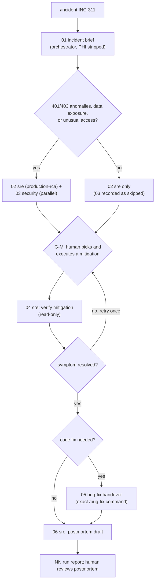

# Workflow: incident response (Frappe edition)

Entry point: `/incident <incident-id> <symptom and time window>` (skill `.claude/skills/incident/SKILL.md`), run by the orchestrator.
Run id: `YYYY-MM-DD-inc-<slug>`. Handoff format: [README.md](README.md).

Goal: a fast, evidence-backed root cause and a human-executed mitigation. **No agent changes a production site.** The sre agent's bash guard (module 05) allows only read-only diagnostics on `test.localhost` (`bench --site test.localhost doctor`, `show-pending-jobs`, `tail`/`grep` of bench logs) and read-only `git`; evidence from a country production site is pasted by a human, redacted. `bench --site * migrate`, `execute`, `console`, `set-config` and `run-patch` are `ask` rules and `bench drop-site`, `reinstall`, `restore` are denied in `.claude/settings.json`. Code fixes leave this workflow and go through [bug-fix.md](bug-fix.md).

## Steps

| step | file | agent | inputs | output | gate / condition |
|---|---|---|---|---|---|
| 01 | `01-incident-brief.md` | orchestrator | `incident:<id>` | symptom, start time, affected site(s) and country, affected endpoints or queues, blast radius, recent deploys and migrates as reported by the human (sre checks `git log` in 02); no patient identifiers | none |
| 02 | `02-sre.md` | sre (`production-rca`, `performance-review`) | 01 | timeline, hypotheses ranked by evidence, "mitigate now / fix / prevent" | parallel with 03 |
| 03 | `03-security.md` | security | 01 | exposure assessment: was PHI returned, logged (Error Log, `logs/*.log`, RQ job kwargs), or were permission rules bypassed | **conditional**: 401/403 anomalies, data exposure, unexpected access; parallel with 02 |
| G-M | none | human | 02, 03 | the human runs one mitigation on the affected site and reports the outcome in the session | **gate**: nothing proceeds until the human reports |
| 04 | `04-sre.md` | sre | 02, human outcome | before/after evidence from read-only commands; hypothesis confirmed or rejected | retry G-M once if not resolved, then `needs-human` |
| 05 | `05-bug-fix-handover.md` | orchestrator | 02, 04 | the `/bug-fix` command line and evidence ids for the code fix | only if a code change is needed |
| 06 | `06-postmortem.md` | sre | all | timeline, root cause, contributing factors, action items with owners | human review |
| last | `NN-run-report.md` | orchestrator | all | summary, open actions | none |

## Triage signals for the two common Frappe incidents

| symptom | read-only evidence (sre, or pasted by a human from the country site) | typical root cause | mitigate now (human only) |
|---|---|---|---|
| slow `lastn` (p95 on `/api/method/spice_lite.api.fhir.lastn` above 2 s, error rate normal) | gunicorn access log timings by `subjects` count; Postgres slow-query log showing repeated `SELECT ... FROM "tabSL Observation" WHERE "patient" = ...`; query count per call from a test (`2` SQL calls per subject, `200` for 100 subjects, measured on this bench) | the `TEACHING-DEFECT(perf-n+1)` loop in `lastn()`: one `frappe.get_doc` plus one `frappe.get_all(fields=["*"])` per subject | cap `subjects` at the reverse proxy or client (for example 20); add gunicorn workers only as a stopgap (it does not remove round trips) |
| RQ queue backlog (jobs pile up in `default` or `long`, scheduled jobs late) | `bench --site <site> doctor` (workers online, jobs per queue and method); `bench --site <site> show-pending-jobs` (prints each job's method **and kwargs**: redact before pasting, kwargs can carry document names or PHI); `logs/worker.error.log`; the `RQ Job` list in desk filtered by status | a job exceeding its queue timeout (`short`/`default` 300 s, `long` 1500 s) and retrying, a burst of `frappe.enqueue` calls without `deduplicate=True`/`job_id`, or too few workers for the queue | start or scale workers for that queue in the process manager; `bench --site <site> disable-scheduler` to stop new scheduled jobs; `purge-jobs` only by a human who accepts the data loss |

## Worked input (spice_lite)

`/incident INC-311 p95 latency on lastn above 2s since 14:05 UTC on the KE site, subjects up to 100, error rate normal, no deploy since yesterday`. 02-sre is expected to find the N+1 loop in `spice_lite/api/fhir.py` `lastn()` (marker `TEACHING-DEFECT(perf-n+1)`, 2 SQL calls per subject; see `sample-app/docs/KNOWN_DEFECTS.md` T-1) and to propose: mitigate now (cap `subjects`), fix (one permission-aware `frappe.get_list` per DocType instead of per subject, handed to `/bug-fix` in step 05; allowed by CLAUDE.md rule 8 because the report is explicitly about `lastn` performance), prevent (`assertQueryCount` test per `context/standards/testing-standards.md`). Security is skipped: the symptom is latency with normal error rates and no permission anomaly.

## Failure and retry policy

| failure | action |
|---|---|
| sre cannot reach the affected site (its guard only allows `test.localhost`) | sre returns `blocked` with the exact read-only commands a human should run on the country site; the human pastes redacted output and the orchestrator relaunches 02 once |
| hypotheses not supported by evidence | sre returns `needs-human` listing the missing evidence; do not guess a root cause |
| mitigation does not resolve the symptom | one more G-M round, then `needs-human` (escalate to the on-call lead for that country) |
| PHI appears in pasted logs, Error Log excerpts or `show-pending-jobs` kwargs | orchestrator stops, asks the human to redact, and does not save the unredacted text into the run folder |
| invalid handoff, agent error | as in [feature-delivery.md](feature-delivery.md) |
