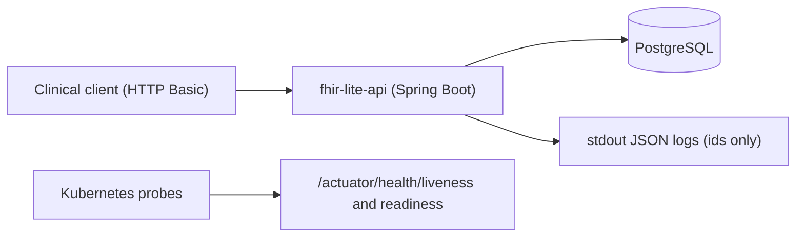

# Architecture overview: FHIR-lite API

## Context
A single Spring Boot 3.5 service (Java 21) exposing FHIR-lite `Patient` and `Observation` resources over REST, backed by PostgreSQL (H2 in PostgreSQL mode for `local` and tests). Deployed to Kubernetes as one Deployment behind a ClusterIP Service.

## Components (package `org.example.fhir`)
| Package | Responsibility | Key types |
|---|---|---|
| `api` | HTTP, DTO mapping, Bundle assembly | `PatientController`, `ObservationController`, `PatientResource`, `ObservationResource`, `PatientMapper`, `ObservationMapper`, `Bundle` |
| `service` | Business rules, transactions | `PatientService`, `ObservationService` |
| `repository` | Spring Data JPA | `PatientRepository`, `ObservationRepository` |
| `domain` | JPA entities | `Patient`, `Observation` |
| `error` | Exception → `OperationOutcome` mapping | `FhirApiException`, `GlobalExceptionHandler`, `OperationOutcome` |
| `config` | Security filter chain, users | `SecurityConfig`, `SecurityProperties` |
| `audit` | PHI-safe audit events | `AuditLogger` |

## Data model (`db/migration/V1__init.sql`)
- `patient(id, mrn_system, mrn UNIQUE, family_name, given_names, gender, birth_date, active)`, index `ix_patient_family_name`.
- `observation(id, status, code_system, code, code_display, patient_id FK → patient ON DELETE CASCADE, effective_date_time, value_quantity, value_unit)`, index `ix_observation_patient_code (patient_id, code)`.

## Endpoints
`GET/PUT/DELETE /fhir/Patient/{id}`, `GET /fhir/Patient?family=&identifier=`, `POST /fhir/Patient`, `GET /fhir/Observation/{id}`, `GET /fhir/Observation?subject=Patient/{id}&code=`, `POST /fhir/Observation`, `GET /fhir/Observation/$lastn?subjects=1,2,3&code=`. `DELETE` requires `ADMIN`. Health endpoints are public.

## Known constraints and decisions
- Surrogate `BIGINT` ids exposed as FHIR ids (ADR candidate: switch to UUIDs to avoid enumeration).
- No pagination yet on searches (risk: unbounded results).
- `$lastn` contains an intentional N+1 (`service/ObservationService.java`, marker `TEACHING-DEFECT(perf-n+1)`), used by performance exercises.
- Patient search without parameters returns 400 to avoid full-table listing.

## ADRs
See `docs/adr/`. ADR format: `docs/adr/0000-template.md`.
