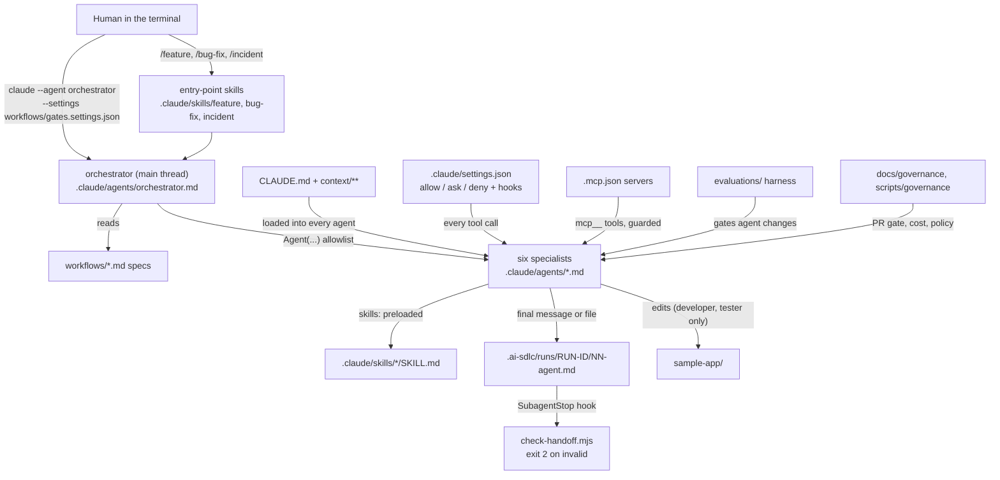

# Capstone: the AI-SDLC engineering system, assembled

Module `11-capstone` of the course. This folder shows how every component in `AI-SDLC/` fits together, walks one feature and one incident through the whole system, and gives you a checklist for making the system your own.

| File | What it is |
|---|---|
| [README.md](README.md) | this file: component map, gate map, how to prove the system is wired |
| [walkthrough-feature.md](walkthrough-feature.md) | PAT-142 (`_count` paging on Patient search) through the system, command by command |
| [walkthrough-incident.md](walkthrough-incident.md) | INC-2026-0922-01 (`$lastn` latency, probe restarts) through the system, command by command |
| [example-runs/incident-lastn-latency/](example-runs/incident-lastn-latency/) | the committed handoffs of that incident run (validated by `check-handoff.mjs`) |
| [personalize-checklist.md](personalize-checklist.md) | what to change to run this system on your own stack and domain |
| `../../scripts/capstone/verify-system.mjs` | one command that checks the whole system is wired (PASS/FAIL table) |
| `../../scripts/capstone/stack-inventory.mjs` | lists every file that encodes the Java/FHIR/Kubernetes assumptions, per component |

## Component map



Every row below is a folder or file group in `AI-SDLC/`. **Tag** says whether the file's format is a real Claude Code format checked against the docs (`verified-format`) or a convention of this course (`illustrative`). A script's behaviour is tested either way; the tag is only about Claude Code format claims.

| Path | Purpose | Built in module | Tag |
|---|---|---|---|
| `CLAUDE.md` | project memory: layout, 3 `@imports`, 7 rules, commands | 00-example | verified-format |
| `.claude/rules/sample-app-java.md` | Java conventions, loaded only for `sample-app/src/**/*.java` (`paths`) | 00-example | verified-format |
| `context/architecture/`, `context/domain/`, `context/security/`, `context/standards/` | context pack agents read on demand; PHI classification and policy | 00-example | illustrative |
| `docs/adr/` | ADR template and ADR-0001; ADR-0002 comes from a feature run | 00-example, 03 | illustrative |
| `agents/CONTRACT_TEMPLATE.md`, `docs/foundations/` | Agent Contract template, anatomy and primitive-choice exercises, contract validator | 01-foundations | illustrative |
| `evaluations/agent-versions/reviewer-v1.md` | the first agent, frozen as the v1 snapshot module 09 compares against | 02-first-agent-skill-tools | verified-format |
| `.claude/skills/explain-endpoint/`, `.claude/skills/run-tests/` | first skills; `run-tests/scripts/summarize-surefire.mjs` summarises Maven output | 02-first-agent-skill-tools | verified-format (SKILL.md), illustrative (scripts) |
| `docs/tutorials/level-2/` | restricted reviewer example, Bash guard hook and its test, practice patches | 02-first-agent-skill-tools | illustrative |
| `.claude/skills/architecture-review/`, `code-review/`, `test-strategy/` | production skills preloaded by architect, reviewer, tester; `code-review` replaces the bundled `/code-review` here | 03-skills-architecture-code-test | verified-format (SKILL.md), illustrative (templates, scripts, examples) |
| `.claude/skills/security-review/`, `performance-review/`, `production-rca/` | security, performance and RCA skills preloaded by security and sre; the RCA evidence pack for INC-2026-0922-01 | 04-skills-security-performance-rca | verified-format (SKILL.md), illustrative (examples, scripts) |
| `skills/<name>/README.md`, `CHANGELOG.md`, `tests/cases.json` | each skill as an owned, versioned asset with golden cases | 03, 04 | illustrative |
| `.claude/agents/architect.md` ... `sre.md` | the six specialist subagents: tools, `disallowedTools: Agent`, model, effort, `maxTurns`, preloaded skills, scoped hooks | 05-agent-roster | verified-format |
| `agents/<name>/CONTRACT.md` | Agent Contract per roster agent (orchestrator's from module 08) | 05, 08 | illustrative |
| `agents/tool-guard.mjs`, `agents/check-agents.mjs` | per-agent write-scope and Bash allowlist hook; contract-conformance checker | 05-agent-roster | illustrative (registered through verified-format frontmatter `hooks`) |
| `.mcp.json` | GitHub, Atlassian and the local `fhir-readonly` stdio server | 06-mcp-and-tooling-architecture | verified-format |
| `mcp/fhir-readonly-server/` | zero-dependency, PHI-safe MCP server and its test client | 06 | illustrative |
| `mcp/permissions.settings-fragment.json` | MCP permission rules to merge into settings | 06 | verified-format |
| `.claude/skills/ticket-intake/`, `docs/mcp/`, `scripts/automation/` | Jira intake with PHI redaction; MCP decision guide; deterministic Flyway, PHI and MCP-config gates | 06 | verified-format (SKILL.md), illustrative (rest) |
| `workflows/composition/` | one-vs-many measurement, execution modes, depth limits, `check-roster-flat.mjs`, `depth-2.settings.json` | 07-agent-composition | illustrative (`depth-2.settings.json` verified-format) |
| `.claude/agents/orchestrator.md` | main-thread orchestrator: `Agent(architect, developer, reviewer, tester, security, sre)`, no Bash, `SubagentStop` hook | 08-workflow-orchestration | verified-format |
| `.claude/skills/feature/`, `bug-fix/`, `incident/`, `requirements/`, `implementation-plan/` | slash-command entry points and the orchestrator's own steps | 08 | verified-format |
| `workflows/README.md`, `feature-delivery.md`, `bug-fix.md`, `incident-response.md`, `examples/` | handoff format, workflow specs, the committed PAT-142 feature run | 08 | illustrative |
| `workflows/gates.settings.json` | `ask` rule on `Agent(developer)`: gate G1 | 08 | verified-format |
| `.claude/hooks/check-handoff.mjs` (+ test) | validates handoffs as a `SubagentStop` hook (exit 2) and as a CLI | 08 | illustrative |
| `evaluations/` (except `agent-versions/reviewer-v1.md`) | golden tasks, harness (`--mode replay` offline, `--mode live` with `claude -p`), rubrics, synthetic recordings, reports | 09-agent-evaluation | illustrative |
| `.claude/settings.json` | permissions `allow`/`ask`/`deny`, `PreToolUse` and `PostToolUse` hooks | 00 (base), 10-governance (extended) | verified-format |
| `.claude/hooks/block-secrets.mjs`, `guard-outbound.mjs`, `flag-injection.mjs` (+ tests) | block secrets in writes; `ask`/`deny` on MCP writes; flag injected instructions | 00, 10 | illustrative |
| `docs/governance/` | approval gates, prompt injection, secrets, model and cost policy, CODEOWNERS and CI gate examples | 10 | illustrative (`managed-settings.example.json` verified-format) |
| `company-ai/` | the skill library packaged as a plugin | 10 | verified-format (`plugin.json`, SKILL.md) |
| `skills/README.md`, `scripts/governance/` | library policy; policy, cost, approval and library validators | 10 | illustrative |
| `README.md`, `docs/capstone/`, `scripts/capstone/` | entry point, this capstone, system verification and stack inventory | 11-capstone | illustrative |
| `sample-app/` | Java 21 / Spring Boot 3.5 FHIR-lite API; one planted defect and D-01..D-04 in `docs/KNOWN_DEFECTS.md` | shared | not a Claude Code file |
| `.ai-sdlc/runs/` | handoffs of live runs (git-ignored) | runtime | illustrative |

## Gate map: workflow gates and governance layers

Module 08 numbers the workflow gates (G1 to G3, plus G-M in incidents). Module 10 numbers the governance layers (G1 to G8 in `docs/governance/approval-gates.md`). They are the same controls seen from two sides:

| Workflow gate (module 08) | When | Mechanism that enforces it | Governance layer (module 10) |
|---|---|---|---|
| G1 plan approval | every developer launch | `ask` rule `Agent(developer)` from `workflows/gates.settings.json` (loaded with `--settings`) | G1 plan approval, implemented as a permission `ask` (G2 row) instead of plan mode |
| G2 findings | after tester/security and after code review | the orchestrator stops with `status: needs-human` (a prompt instruction, pattern not a built-in feature); the mechanical backstop is the next `Agent(developer)` prompt and PR review | none: this is the one gate enforced by convention |
| G-M mitigation | incidents, after 02-sre | no agent can change production: orchestrator has no Bash; sre's `tool-guard.mjs` always denies mutating `kubectl`; `kubectl apply` is `ask`, `kubectl delete` is `deny` | G2 risky command, G5 never allowed |
| G3 merge | end of every run | human PR review; `git push` is `ask`, `gh pr merge` and MCP merge are `deny` | G6 AI-config PR gate, G7 code PR approval |
| always on | every tool call | secrets hook, outbound MCP hook, injection flag, `Edit(./.claude/**)` ask, managed floor | G3, G4, G5, G8 |

## Prove the system is wired

```bash
cd AI-SDLC
node scripts/capstone/verify-system.mjs              # structure + spawned checkers; exit 0 = WIRED
node scripts/capstone/verify-system.mjs --with-tests # also every *.test.mjs in the repo
node scripts/capstone/verify-system.mjs --with-maven # also cd sample-app && mvn -q -B test
node scripts/capstone/verify-system.test.mjs         # the checker's own tests
```

It checks: roster files and contracts, flat delegation, preloaded skills, settings and every hook script path (settings and frontmatter), the G1 gate settings, `.mcp.json`, that workflow step tables name only roster agents and real skills, that CLAUDE.md imports resolve, that each script a preloaded skill tells an agent to run is allowed by that agent's Bash guard, that every committed example run passes `check-handoff.mjs`, that the eval replay passes its gates, and that the module checkers (`check-agents`, `check-roster-flat`, `check-agent-policy`, `validate-skill-library`, `check-mcp-config`) exit 0.
