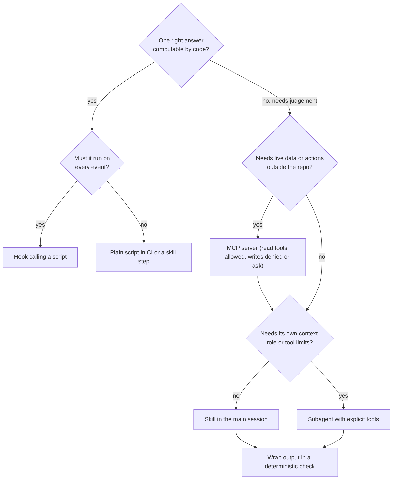

# Skill, MCP server, agent, hook or plain script?

Use this when you are about to add a capability to the AI-SDLC system. Pick the **least powerful** mechanism that does the job; every step up the list costs tokens, adds non-determinism, and widens what can go wrong.

## Decision table

| Question about the job | If yes, use | Example in this repo | Why not something heavier |
|---|---|---|---|
| Is there exactly one right answer that code can compute (naming, diff, checksum, regex, schema)? | **Plain script** (Node/bash), run by CI, a hook or a skill step | `scripts/automation/check-flyway-migrations.mjs`, `scan-phi.mjs`, `check-mcp-config.mjs` | An agent would be slower, cost money on every run, and could be talked out of the answer by the input it reads. |
| Must it run on every matching event, whatever the model decides? | **Hook** (calls a script) | `.claude/hooks/block-secrets.mjs` on `Edit\|Write` | A skill or CLAUDE.md line is advice; only a hook (exit 2 or a deny decision) blocks. |
| Does the model need live data or actions from a system outside the repo (GitHub, Jira, a database)? | **MCP server** | `github`, `atlassian`, `fhir-readonly` in `.mcp.json` | A script run through `Bash` works for one-off reads, but MCP gives typed tools, per-tool permission rules (`mcp__github__merge_pull_request` in `deny`) and one config for every agent. |
| Is it a repeatable procedure with judgement in it (read, classify, write a structured result)? | **Skill** | `.claude/skills/ticket-intake/SKILL.md` | An agent adds a separate context and a handoff for something the main session can do in-line. |
| Does it need its own context window, a restricted tool set, or a different role, and does it produce a handoff? | **Subagent** | `.claude/agents/security.md` (module `05-agent-roster`) | Only worth it when isolation or a narrower toolset is the point. |
| Does it sequence several of the above with human gates? | **Orchestrator** (main session, module `08-workflow-orchestration`) | `/feature` | Never a first choice. |

**Deterministic automation beats AI when** the rule is fully specified, the cost of a wrong answer is high, and the input may be hostile. Migration immutability, PHI pattern scans, config lint, secret detection and test pass/fail all qualify. AI earns its place where the input is unstructured (a ticket written on a ward) or the output needs judgement (a design trade-off); even then, wrap it in a deterministic check (the intake skill must get `PASS` from `scan-phi.mjs` before it reports done).

## Flowchart

## How the pieces combine for one ticket

1. Human runs `/ticket-intake FHIR-142` (skill).
2. The skill calls `mcp__atlassian__getJiraIssue` (MCP read, allowed by rule).
3. It writes `00-ticket-intake.md` and runs `scan-phi.mjs` (script, deterministic gate).
4. The architect subagent reads the handoff and calls `mcp__fhir-readonly__explain_query_plan` (MCP read) to reason about indexes without database access.
5. The developer adds `V2__*.sql`; CI runs `check-flyway-migrations.mjs --base origin/main` (script). A change to `V1__init.sql` fails the build no matter how convincing the PR description is.
6. Opening the PR through `mcp__github__create_pull_request` prompts a human (`ask`); merging is denied to every agent.
