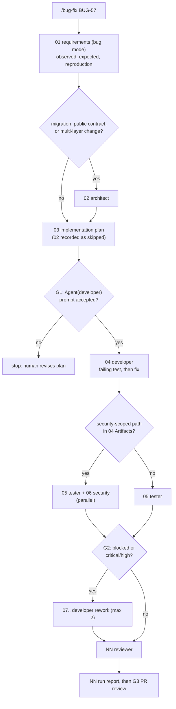

# Workflow: bug fix

Entry point: `/bug-fix <bug-id> <observed behaviour>` (skill `.claude/skills/bug-fix/SKILL.md`), run by the orchestrator with `--settings workflows/gates.settings.json`.
Run id: `YYYY-MM-DD-bug-<slug>`. Handoff format: [README.md](README.md).

The difference from feature delivery: the evidence comes first. No fix is accepted without a regression test that fails before the fix and passes after it (`context/standards/testing-standards.md`: "Every bug fix starts with a failing test").

## Steps

| step | file | agent | inputs | output | gate / condition |
|---|---|---|---|---|---|
| 01 | `01-requirements.md` | orchestrator (`requirements`, bug mode) | `ticket:<bug-id>` | observed vs expected, reproduction (synthetic data), regression test name `<bugid>_<behaviour>` | none |
| 02 | `02-architect.md` | architect | 01 | design impact, ADR if a contract changes | **conditional**: only for migration / public contract / multi-layer changes |
| 03 | `03-implementation-plan.md` | orchestrator (`implementation-plan`) | 01, 02 if present | root-cause hypothesis with `path:line`, test first, fix steps | `needs-human` |
| 04 | `04-developer.md` | developer | 03 | regression test (red, with the failure output), fix (green), full `mvn -q -B test` | **G1** |
| 05 | `05-tester.md` | tester | 01, 04 | neighbouring cases around the bug (boundaries, other params) | parallel with 06 |
| 06 | `06-security.md` | security | 04 | findings | **conditional** on security-scoped paths (same list as [feature-delivery.md](feature-delivery.md)); parallel with 05 |
| 07, 08 | `NN-developer.md` | developer | blocking handoffs | fixes | after **G2** |
| next | `NN-reviewer.md` | reviewer | 03, 04, 05, 06 | findings; checks that 04 shows the red run before the green run | G2 if critical/high |
| last | `NN-run-report.md` | orchestrator | all | summary | **G3** |

## Worked input (sample app)

`/bug-fix BUG-57 Family search ignores trailing spaces only when identifier is also given`. `PatientService.search` trims `family` in the MRN branch filter (`p.getFamilyName().equalsIgnoreCase(family.trim())`) and in `findByFamilyNameIgnoreCaseOrderByIdAsc(family.trim())`, so the orchestrator's 01 step records **Observed/Expected** and asks for a reproduction first. If the reproduction test passes on `main`, 03 is `blocked` with "cannot reproduce" and the run stops at the first gate. That is the correct outcome, not a failure of the workflow.

## Failure and retry policy

| failure | action |
|---|---|
| reproduction test passes before the fix (cannot reproduce) | developer returns `blocked`; orchestrator stops with `needs-human` and asks for more detail; no fix is written |
| fix makes the regression test pass but breaks another test | developer handles it (three cycles), else `blocked` |
| bug is the `TEACHING-DEFECT(perf-n+1)` | only proceed if the report is explicitly about `lastn` performance (CLAUDE.md rule 6); otherwise stop with `needs-human` |
| invalid handoff, agent error, third rework | as in [feature-delivery.md](feature-delivery.md) |
