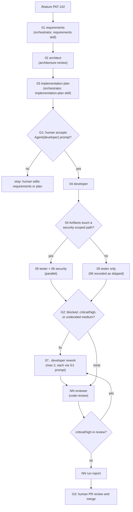

# Workflow: feature delivery

Entry point: `/feature <ticket-id> 
` (skill `.claude/skills/feature/SKILL.md`), run by the orchestrator (`claude --agent orchestrator --settings workflows/gates.settings.json`, or an ordinary main session with the same `--settings`).
Run id: `YYYY-MM-DD-feat-<slug>`. Handoff format and run folder rules: [README.md](README.md). Worked example: [examples/feature-patient-pagination/](examples/feature-patient-pagination/).

## Steps

| step | file | agent | skill | inputs | output | gate / condition |
|---|---|---|---|---|---|---|
| 01 | `01-requirements.md` | orchestrator | `requirements` | `ticket:<id>` or `00-ticket-intake.md` (module 06) | user story, AC table, non-functional, scope | none |
| 02 | `02-architect.md` | architect | `architecture-review` (preloaded) | `01-requirements.md` | options, trade-offs, ARC findings, ADR draft | none |
| 03 | `03-implementation-plan.md` | orchestrator | `implementation-plan` | 01, 02 | plan table P1..Pn, security scope, rollback | status always `needs-human` |
| 04 | `04-developer.md` | developer | `run-tests` (preloaded) | 03 | code + tests, `mvn -q -B test` result, changed paths in `## Artifacts` | **G1**: `Agent(developer)` ask prompt |
| 05 | `05-tester.md` | tester | `test-strategy`, `run-tests` | 01, 03, 04 | AC coverage map, new tests, test results | parallel with 06 |
| 06 | `06-security.md` | security | `security-review` | 04 | security findings | **conditional** (below); parallel with 05 |
| 07, 08 | `07-developer.md` | developer | `run-tests` | blocking handoffs | fixes | after **G2**; each launch through G1 prompt |
| next | `NN-reviewer.md` | reviewer | `code-review` | 03, 05, 06, latest developer | findings + verdict | G2 again if critical/high |
| last | `NN-run-report.md` | orchestrator | none | all | step table, open findings, human actions | ends with **G3** |

Step numbers are fixed through 06. Skipped steps keep their number unused, so `06` missing from the folder means security was skipped (the run report says why). Rework and review take the next free numbers.

## Conditional branch: security step

The orchestrator reads `04-developer.md` `## Artifacts` (and any rework developer handoff). Security runs if at least one path matches:

- `sample-app/src/main/java/org/example/fhir/api/**` (new or changed endpoints, DTOs, `Bundle`)
- `sample-app/src/main/java/org/example/fhir/config/**` (`SecurityConfig`, `SecurityProperties`)
- `sample-app/src/main/java/org/example/fhir/error/**`, `.../audit/**` (error bodies, audit logging)
- `sample-app/src/main/resources/**` (application config, migrations)
- `sample-app/k8s/**`, `sample-app/pom.xml`, `sample-app/Dockerfile`

Otherwise the orchestrator records `06 security: skipped (no security-scoped path in 04 Artifacts: <list>)` in the run report. A human can force the step by saying so at G1. The rule is conservative on purpose: a service-only change still gets code review, and the reviewer's checklist flags security smells (see module 03).

## Parallel step: tester and security

After 04, the orchestrator launches tester (step 05) and security (step 06) in the same turn. They are independent: tester reads the ACs and the diff and writes tests under `sample-app/src/test/`; security is read-only. Each gets its own pre-assigned file. The orchestrator evaluates G2 only after both handoffs are back. Concurrency and background behaviour: module 07.

## Gates

| gate | when | mechanism | pass condition |
|---|---|---|---|
| G1 plan approval | every developer launch | `permissions.ask: ["Agent(developer)"]` in `workflows/gates.settings.json` | human accepts the prompt after reading 01..03 |
| G2 findings | after 05/06 and after review | orchestrator stops with `needs-human` | no `blocked`, no `critical`/`high`; every `medium` has a fix-or-ticket decision recorded |
| G3 merge | end of run | human PR review; `git push` is `ask` in `.claude/settings.json`; agents never push | PR approved by a human who is not the run starter (branch protection, module 10) |

## Failure and retry policy

| failure | action |
|---|---|
| handoff invalid or missing | `SubagentStop` hook (`check-handoff.mjs`) exits 2, the agent continues and fixes it; if still invalid, orchestrator retries the step once with the hook error in the task, then `needs-human` |
| `status: blocked` from tester or reviewer | rework step for developer with the blocking finding ids (max 2 rework steps) |
| `mvn -q -B test` fails in a developer step | developer handles up to three fix-and-rerun cycles itself (module 05); then `blocked` |
| third rework needed | stop, `needs-human`: the plan or requirements are wrong, not the code |
| G1 prompt rejected | stop; the human edits 01 or 03 (or asks the orchestrator to regenerate 03) and restarts; completed steps are not redone |
| agent error or empty result | retry once, then `needs-human` |
| session interrupted | rerun `/feature` with the same ticket on the same day: the orchestrator resumes from the first step without a `complete` handoff |
