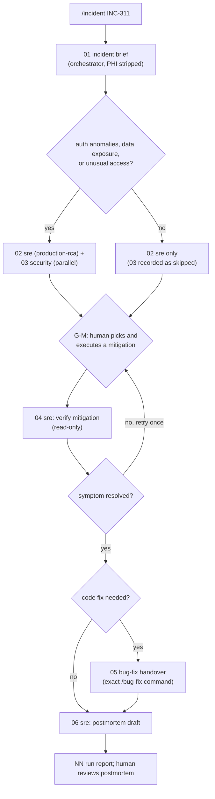

# Workflow: incident response

Entry point: `/incident <incident-id> <symptom and time window>` (skill `.claude/skills/incident/SKILL.md`), run by the orchestrator.
Run id: `YYYY-MM-DD-inc-<slug>`. Handoff format: [README.md](README.md).

Goal: a fast, evidence-backed root cause and a human-executed mitigation. **No agent changes production.** The sre agent runs only read-only `kubectl` and `git` commands (its `PreToolUse` guard, module 05); `kubectl apply` is an `ask` rule and `kubectl delete` is denied in `.claude/settings.json`. Code fixes leave this workflow and go through [bug-fix.md](bug-fix.md).

## Steps

| step | file | agent | inputs | output | gate / condition |
|---|---|---|---|---|---|
| 01 | `01-incident-brief.md` | orchestrator | `incident:<id>` | symptom, start time, affected endpoints, blast radius, recent deploys as reported by the human (sre checks `git log` in 02), no patient identifiers | none |
| 02 | `02-sre.md` | sre (`production-rca`, `performance-review`) | 01 | timeline, hypotheses ranked by evidence, "mitigate now / fix / prevent" | parallel with 03 |
| 03 | `03-security.md` | security | 01 | exposure assessment: was PHI returned or logged, were auth rules bypassed | **conditional**: 401/403 anomalies, data exposure, unexpected access; parallel with 02 |
| G-M | none | human | 02, 03 | the human runs one mitigation (e.g. `kubectl rollout undo`, scale, ingress limit) and reports the outcome in the session | **gate**: nothing proceeds until the human reports |
| 04 | `04-sre.md` | sre | 02, human outcome | before/after evidence from read-only commands; hypothesis confirmed or rejected | retry G-M once if not resolved, then `needs-human` |
| 05 | `05-bug-fix-handover.md` | orchestrator | 02, 04 | the `/bug-fix` command line and evidence ids for the code fix | only if a code change is needed |
| 06 | `06-postmortem.md` | sre | all | timeline, root cause, contributing factors, action items with owners | human review |
| last | `NN-run-report.md` | orchestrator | all | summary, open actions | none |

## Worked input (sample app)

`/incident INC-311 p95 latency on GET /fhir/Observation/$lastn above 2s since 14:05 UTC, error rate normal`. 02-sre is expected to find the N+1 loop in `ObservationService.lastN` (marker `TEACHING-DEFECT(perf-n+1)`, two SQL statements per subject; see `sample-app/docs/KNOWN_DEFECTS.md`) and to propose: mitigate now (cap `subjects` at the ingress, or scale replicas), fix (one set-based query, handed to `/bug-fix` in step 05), prevent (a query-count test per `context/standards/testing-standards.md`). Security is skipped: the symptom is latency with normal error rates and no auth anomaly.

## Failure and retry policy

| failure | action |
|---|---|
| sre lacks cluster access (read-only `kubectl` fails) | sre returns `blocked` with the exact commands a human should run; the human pastes redacted output and the orchestrator relaunches 02 once |
| hypotheses not supported by evidence | sre returns `needs-human` listing the missing evidence; do not guess a root cause |
| mitigation does not resolve the symptom | one more G-M round, then `needs-human` (escalate to on-call lead) |
| PHI appears in pasted logs | orchestrator stops, asks the human to redact, and does not save the unredacted text into the run folder |
| invalid handoff, agent error | as in [feature-delivery.md](feature-delivery.md) |
